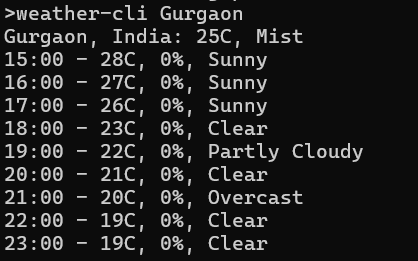

This is a command line interface weather app to see weather forecasts using free weather api.

### Installation

- Clone this repo
- Add your api key in .env file as API_KEY
- Open terminal in the repo's directory
- Run `go build` in terminal
- Run `weather-cli YOUR_CITY_NAME` to see forecasts for your city

#### Preview

